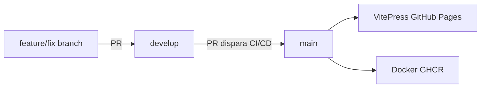

# CI/CD e fluxo de branches

Modelo simplificado com duas branches long-lived e um único pipeline sequencial.

## Branches

| Branch | Papel |
|---|---|
| `develop` | Integração de features e fixes. Base para novos trabalhos. |
| `main` | Fonte da verdade e produção. |

Não existe branch `staging`. Toda entrega passa por PR `develop` → `main`.

## Fluxo de desenvolvimento

```text
feature/fix-*  ──PR──►  develop  ──PR──►  main  ──►  deploy
```

1. Crie a branch a partir de `develop`:
   ```bash
   git checkout develop
   git pull origin develop
   git checkout -b feature/minha-feature
   ```
2. Desenvolva e abra PR para `develop` (sem CI/CD automático).
3. Após integrar em `develop`, abra PR **`develop` → `main`**.
4. O pipeline CI/CD roda **somente** nesse PR (e novamente ao mergear em `main`).
5. Com o merge aprovado, `main` dispara deploy de documentação e imagem Docker.



## Pipeline CI/CD

Arquivo: [`.github/workflows/ci.yml`](workflows/ci.yml)

### Quando executa

| Evento | Condição | O que roda |
|---|---|---|
| `pull_request` | base = `main`, head = `develop` | Testes + build da documentação |
| `push` | branch `main` ou tag `v*.*.*` | Pipeline completo + deploy |
| `workflow_dispatch` | manual | Testes + build da documentação |

PRs para `main` vindos de branches que **não** sejam `develop` são ignorados pelo pipeline.

### Ordem dos jobs (sequencial)

Cada etapa depende da anterior:

```text
Unit tests  →  E2E tests  →  Build documentation  →  Deploy VitePress  →  Publish Docker
     ①              ②                  ③                      ④                  ⑤
```

| # | Job | PR `develop`→`main` | Push `main` |
|---|---|---|---|
| 1 | **Unit tests** — `npm run build` + `npm test` | Sim | Sim |
| 2 | **E2E tests** — `npm run test:e2e` | Sim | Sim |
| 3 | **Build documentation** — `npm run docs:build` | Sim | Sim |
| 4 | **Deploy VitePress** — GitHub Pages | Não | Sim |
| 5 | **Publish Docker image** — GHCR | Não | Sim |

### Entregáveis em produção (`main`)

- **Documentação:** https://vitorjobs.github.io/infosistema-gestao-frotas-lab/
- **Imagem Docker:** `ghcr.io/<owner>/<repository>:latest` (detalhes em [`CD_TARGET.md`](CD_TARGET.md))

## Proteção de branches (GitHub)

Configure em **Settings → Branches**:

### `main`

- Exigir PR antes do merge.
- Exigir aprovação (recomendado: 1).
- Exigir status checks:
  - `Unit tests`
  - `E2E tests`
  - `Build documentation`
- Não permitir push direto.
- Não permitir force push.

### `develop`

- Exigir PR antes do merge (recomendado).
- Sem CI/CD obrigatório (validação ocorre no PR para `main`).
- Não permitir force push.

## Checklist de release

- [ ] Código integrado em `develop`
- [ ] PR aberto: `develop` → `main`
- [ ] Pipeline verde (unit → e2e → docs build)
- [ ] PR aprovado e mergeado
- [ ] Push em `main` conclui deploy (Pages + Docker)

## Remover branch `staging` (legado)

Se a branch `staging` ainda existir no remoto:

```bash
git push origin --delete staging
```

Atualize as regras de proteção no GitHub removendo referências a `staging`.
