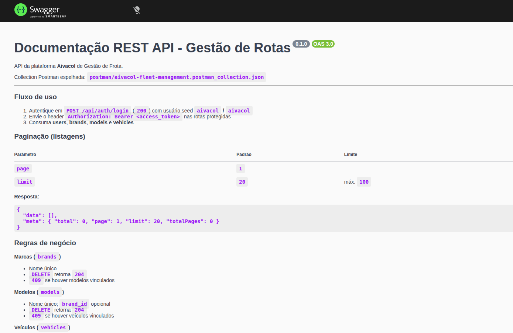
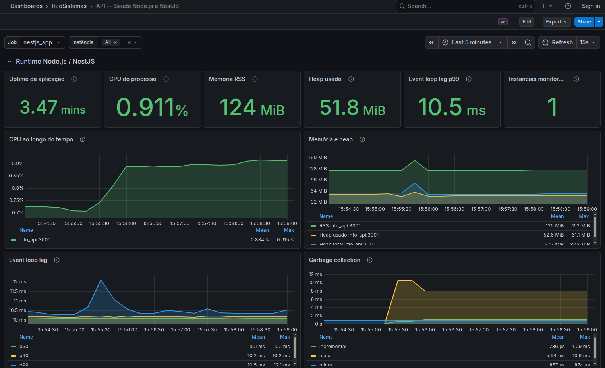
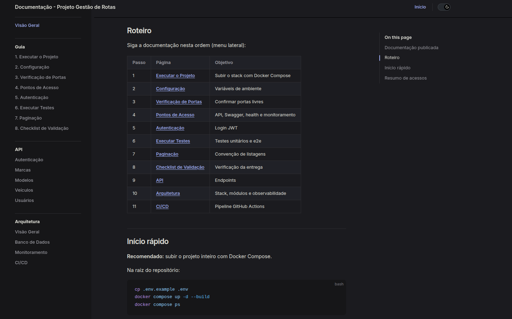

# gestao_frotas_api

Backend da plataforma **Aivacol** de Gestão de Frota — NestJS, TypeORM, SQL Server, JWT, Redis, observabilidade (Prometheus/Grafana) e documentação VitePress.

## Documentação completa

**https://vitorjobs.github.io/infosistema-gestao-frotas-lab/**

Instalação, configuração, API, testes, arquitetura, CI/CD e troubleshooting estão na documentação VitePress.

## Principais recursos

- REST API com prefixo `/api` e autenticação JWT
- CRUD de marcas, modelos, veículos e consulta de usuários
- Cache Redis (ou memória em desenvolvimento)
- Swagger interativo, health check e métricas Prometheus
- Dashboards Grafana provisionados automaticamente
- Auditoria HTTP opcional (MongoDB)
- Stack Docker Compose integrado (SQL Server, Redis, MongoDB, monitoramento e docs)

## Acesso rápido (Docker Compose)

| Recurso | URL |
|---|---|
| Swagger | http://localhost:3001/api/docs |
| Health | http://localhost:3001/api/health |
| Grafana | http://localhost:3002 |
| Prometheus | http://localhost:9090 |
| Documentação local (VitePress) | http://localhost:3003 |

Usuário seed da API: `aivacol` / `aivacol`

## Início mínimo

```bash
cp .env.example .env
docker compose up -d --build
```

Passo a passo completo: [Executar o Projeto](https://vitorjobs.github.io/infosistema-gestao-frotas-lab/getting-started/installation).

## Requisitos

- **Docker e Docker Compose** — caminho recomendado para execução local
- **Node.js 22+** — desenvolvimento ativo e testes automatizados (`npm ci`, `npm test`)

## Preview

Capturas reais obtidas com o stack Docker Compose em execução local.

### Swagger — Documentação REST API

Interface interativa em `http://localhost:3001/api/docs`.



### Monitoramento — Grafana

Dashboards provisionados em `http://localhost:3002` (métricas da API, infraestrutura e dependências).



### Documentação — VitePress

Site estático do projeto em `http://localhost:3003` (publicado em GitHub Pages após merge em `main`).


